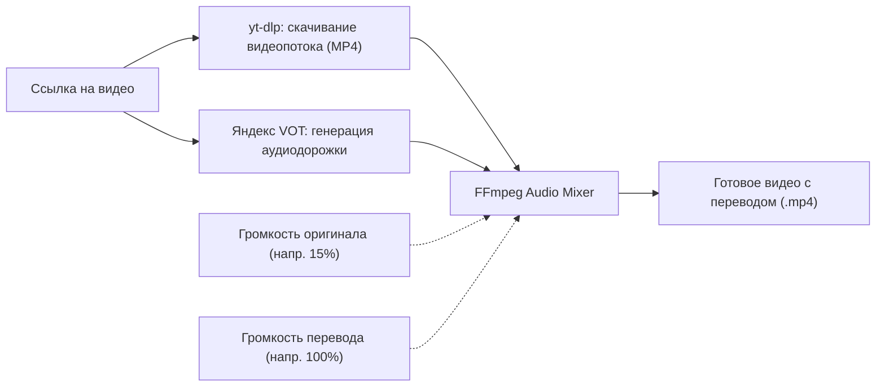

# 🎬 Download Video Mixer v3.15

**Download Video Mixer** — это мощное кроссплатформенное десктопное приложение для комфортного скачивания видео (с YouTube и сотен других платформ) в высоком качестве, автоматического наложения закадрового перевода (Яндекс / VOT) или собственных аудиодорожек, а также интеллектуального перевода названий роликов с помощью нейросетей.

---

## 📑 Содержание
- [✨ Ключевые возможности](#-ключевые-возможности)
- [🎧 Как устроен звук и перевод](#-как-устроен-звук-и-перевод)
- [🤖 Перевод названий роликов (AI / Google)](#-перевод-названий-роликов-ai--google)
- [🛠 Технологический стек](#-технологический-стек)
- [🚀 Быстрый старт (Готовые сборки)](#-быстрый-старт-готовые-сборки)
- [📁 Расположение данных и автономный Runtime](#-расположение-данных-и-автономный-runtime)
- [❓ Частые вопросы и решение проблем](#-частые-вопросы-и-решение-проблем)

---

## ✨ Ключевые возможности

* 📥 **Умная загрузка одиночных видео и плейлистов:**
  * Скачивание отдельных роликов и целых плейлистов по ссылке.
  * Интерактивное окно выбора видео из плейлиста с предпросмотром длительности роликов и пакетным выделением.
  * Пакетная загрузка ссылок из файла `video.txt`, расположенного рядом с исполняемым файлом.
* 🎚 **Два режима работы:**
  * **Видео:** скачивание видео в исходном качестве от **360p** до **4K (2160p)**. Программа анализирует доступные разрешения каждого конкретного ролика и позволяет настроить качество как глобально, так и индивидуально.
  * **Только Аудио (MP3):** мгновенное извлечение чистой аудиодорожки в максимальном качестве (VBR 0 / bestaudio).
* 🗣 **Встроенный автоперевод видео (Яндекс Закадровый перевод / VOT):**
  * Автоматическая генерация и получение закадрового дубляжа без сторонних браузеров и расширений.
  * Интеллектуальный механизм опроса серверов Яндекса со статусами очереди («генерация аудио», «скачивание дорожки», автоповторы при задержке).
* 🎛 **Двухканальный аудио-микшер:**
  * Точная регулировка баланса громкости между оригиналом и переводом (например, 15% оригинальный звук и 100% перевод).
  * Бесшовная и быстрая склейка через FFmpeg без перекодирования видеопотока (`-c:v copy`).
* 📂 **Поддержка собственных аудиофайлов:**
  * Возможность подключить локальный файл озвучки (`.mp3`, `.m4a`, `.wav`) к любому ролику вручную (включается в Настройках ⚙).
* 🧠 **Умный кэш и бережное отношение к трафику:**
  * Если оригинал видео уже скачан, при повторном наложении другого перевода программа использует локальный кэш, не скачивая видео заново.
  * Проверка наличия готового файла («✅ Файл уже существует»).
  * Опциональное удаление исходного видео без перевода после успешной склейки для экономии места на накопителе.
* 🌐 **Перевод названий роликов (Текст):**
  * Клик по названию видео в очереди открывает окно с оригиналом и переводом, а также кнопкой быстрого копирования в буфер обмена.
  * Поддержка бесплатного Google Translate API и нейросетевых моделей (OpenAI / OpenRouter) с автопоиском доступных бесплатных моделей.
* 🚀 **100% Portable и автономность (Zero-Configuration):**
  * Не требует ручной установки Python, Node.js, FFmpeg или yt-dlp.
  * При первом старте менеджер зависимостей в фоновом режиме сам разворачивает изолированный runtime.
  * Встроенная функция автоматического обновления движка yt-dlp (`-U`) при запуске.
* 🎨 **Современный GUI:**
  * Интерфейс на CustomTkinter с поддержкой системных тем, скругленных элементов, плавных анимаций появления/затухания (`fade-in`/`fade-out`), контекстных меню по правому клику (Вставить / Копировать / Вырезать).

---

## 🎧 Как устроен звук и перевод

1. **Оригинал:** Скачивается наилучший видеопоток выбранного разрешения и аудиодорожка через движок `yt-dlp`.
2. **Перевод:** Запрашивается голосовой перевод у серверов Яндекса через модуль `vot-cli-live` (или используется выбранный локальный файл).
3. **Склейка:** Запускается `ffmpeg -filter_complex`, где громкости обеих дорожек масштабируются ползунками из настроек, после чего накладываются друг на друга в новый AAC-поток. Исходный видеоряд копируется напрямую (`-c:v copy`), поэтому склейка занимает считанные секунды и не пережимает картинку.

---

## 🤖 Перевод названий роликов (AI / Google)

В настройках программы (кнопка **⚙**) в блоке **«Перевод названий (Текст)»** можно выбрать подходящий движок:

1. **Не переводить** — стандартный режим.
2. **Google API** — быстрый перевод названий через API Google Translate без ключей и авторизаций.
3. **Нейросеть (OpenAI / OpenRouter)**:
   * Нажмите кнопку **«Настройка API»** и укажите ваш API-токен (например, бесплатный ключ от [OpenRouter](https://openrouter.ai/)).
   * Поддерживается указание любого совместимого **Base URL** и выбор модели (по умолчанию используется `openrouter/free`).
   * Встроена автоматическая ротация и fallback по пулу бесплатных моделей (`gemma-2-9b`, `llama-3.1-8b`, `qwen-2-7b`, `mistral-7b`, `phi-3-mini`, `nemotron-3.5`).
   * В диалоге перевода названия есть кнопка **«🔄 Другая модель»**, которая мгновенно перегенерирует перевод на альтернативной нейросети и добавляет нестабильные модели во временный блэклист.

---

## 🛠 Технологический стек

* **Графический интерфейс:** [CustomTkinter](https://github.com/TomSchimansky/CustomTkinter)
* **Загрузка медиа:** [yt-dlp](https://github.com/yt-dlp/yt-dlp)
* **Обработка аудио и видео:** [FFmpeg](https://ffmpeg.org/)
* **Голосовой перевод:** [vot-cli-live](https://github.com/fantomcheg/vot-cli-live) на базе изолированного Node.js v20 LTS

---

## 🚀 Быстрый старт (Готовые сборки)

Вам **не нужно** настраивать Python, терминал или устанавливать кодеки:

1. Откройте страницу **[Releases](../../releases)** этого репозитория.
2. Скачайте дистрибутив для вашей системы:
   * **Windows:** файл `Download Video Mixer.exe`
   * **macOS:** файл `Download Video Mixer-macOS.dmg`
3. Запустите приложение:
   * При первом запуске приложение скачает необходимые автономные модули (Node.js, FFmpeg, yt-dlp, vot-cli). Прогресс отображается в статусной строке.
4. Вставьте ссылку на ролик или плейлист, нажмите **«Добавить»** и запустите очередь кнопкой **«▶ Запустить очередь»**.

> [!TIP]
> Чтобы скачать сразу большой список ссылок, положите рядом с программой текстовый файл `video.txt` со ссылками (по одной на строчку). При запуске программа автоматически подхватит их в очередь!

---

## 📁 Расположение данных и автономный Runtime

Все скачанные утилиты, кэш, настройки и логи сохраняются в изолированной системной директории пользователя:

* **Windows:** `%LOCALAPPDATA%\Download Video Mixer\`
  * `runtime\bin\` — бинарные файлы `ffmpeg.exe` и `yt-dlp.exe`
  * `runtime\node\` — автономный дистрибутив Node.js
  * `runtime\node_modules\` — локально установленный модуль `vot-cli-live`
  * `settings.json` — сохранённые настройки (путь сохранения, громкости, токен AI и т.д.)
  * `logs\error.log` — лог ошибок для быстрой отладки
* **macOS:** `~/Library/Application Support/Download Video Mixer/`
  * `runtime/bin/` — бинарные файлы `ffmpeg` и `yt-dlp`
  * `runtime/node/` — автономный дистрибутив Node.js
  * `runtime/node_modules/` — локально установленный модуль `vot-cli-live`
  * `settings.json` — сохранённые настройки
  * `logs/error.log` — лог ошибок

> [!NOTE]
> Если вам необходимо полностью сбросить настройки или переустановить внутренние зависимости, откройте **Настройки (⚙)** и нажмите красную кнопку **«Очистить данные и зависимости...»**.

---

## ❓ Частые вопросы и решение проблем

<b>1. Почему перевод видео занимает некоторое время?</b>

Озвучка генерируется нейросетью на стороне серверов Яндекса в реальном времени. Для длинных роликов (30–60+ минут) генерация может занять от 1 до нескольких минут. Программа автоматически ждёт готовности дорожки с интервалом в 15 секунд.

<b>2. Выдаётся ошибка «Лимит запросов» при переводе названий</b>

При использовании Google Translate без ключа при слишком частых запросах может сработать временный лимит (HTTP 429). В настройках переключитесь на «Нейросеть (OpenAI/OpenRouter)» и укажите бесплатный токен от OpenRouter.

<b>3. Как приглушить оригинальный звук сильнее или убрать его совсем?</b>

Откройте **Настройки (⚙)** и перетащите ползунок **«Громкость оригинала»** на `0%` (только чистый перевод) или любое комфортное для вас значение (например, `5%`–`10%`).

<b>4. Где посмотреть лог ошибок, если что-то пошло не так?</b>

Ошибки подробно записываются в файл <code>error.log</code> внутри папки данных приложения:
<ul>
  <li><b>Windows:</b> <code>%LOCALAPPDATA%\Download Video Mixer\logs\error.log</code></li>
  <li><b>macOS:</b> <code>~/Library/Application Support/Download Video Mixer/logs/error.log</code></li>
</ul>

---

## 📄 Лицензия
Проект распространяется под открытой лицензией MIT. Подробности см. в файле [LICENSE](LICENSE).
